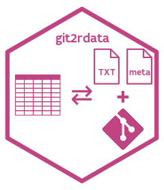

# The `git2rdata` package 

[](https://www.repostatus.org/#wip)
[](https://www.tidyverse.org/lifecycle/#experimental)
[](https://www.gnu.org/licenses/gpl-3.0.en.html)
[](https://cran.r-project.org/)
[](https://travis-ci.org/inbo/git2rdata)
[](https://ci.appveyor.com/project/ThierryO/git2rdata/branch/master)
[](https://codecov.io/gh/inbo/git2rdata)
[](https://zenodo.org/badge/latestdoi/147685405)
## Rationale

The `git2rdata` package writes and reads dataframes as plain text files. Important information is stored in a metadata file.

1. Storing metadata allows to maintain variables classes. By default, the data is optimized for file storage prior to writing. This makes the data less human readable and can be turned off. Details on the implementation are available in the [plain text](https://inbo.github.io/git2rdata/articles/plain_text.html) vignette.
1. Storing metadata also allows to minimize row base [diffs](https://en.wikipedia.org/wiki/Diff) between two consecutive [commits](https://en.wikipedia.org/wiki/Commit_(version_control)). This is a useful feature when storing data as plain text files under version control. Details on this part of the implementation are available in the [version control](https://inbo.github.io/git2rdata/articles/version_control.html) vignette. Although `git2rdata` was envisioned with a [git](https://git-scm.com/) workflow in mind, it can also be used in combination with other version control systems like [subversion](https://subversion.apache.org/) or [mercurial](https://www.mercurial-scm.org/).
1. `git2rdata` is intended to facilitate a reproducible and traceable workflow. A toy example is given in the [workflow](https://inbo.github.io/git2rdata/articles/workflow.html) vignette.
1. The [efficiency](https://inbo.github.io/git2rdata/articles/efficiency.html) vignette provides some insight into efficiency in terms of file storage, git repository size and speed for writing and reading.

## Installation

Install the development version

```r
# installation requires the "remotes" package
# install.package("remotes")

# install with vignettes (recommended)
remotes::install_github(
  "inbo/git2rdata", 
  build = TRUE, 
  dependencies = TRUE, 
  build_opts = c("--no-resave-data", "--no-manual")
)
# install without vignettes
remotes::install_github("inbo/git2rdata"))
```

## Main usage

Dataframes are stored using `write_vc()` and retrieved with `read_vc()`. Both functions share the arguments `root` and `file`. `root` refers to a base location where the dataframe should be stored. It can either point to a local directory or a local git repository. `file` is the file name to use and can include a path relative to `root`. Make sure the relative path stays within `root`.

```r
library(git2rdata)
root <- "~/myproject" # local directory
root <- git2r::repository("~/my_git_repo") # git repository
write_vc(my_data, file = "rel_path/filename", root = root)
read_vc(file = "rel_path/filename", root = root)
```

## Citation

Please use the output of `citation("git2rdata")`

## Folder structure

- `R`: The source scripts of the [R](https://cran.r-project.org/) functions with documentation in [Roxygen](https://github.com/klutometis/roxygen) format
- `man`: The help files in [Rd](https://cran.r-project.org/doc/manuals/r-release/R-exts.html#Rd-format) format
- `testthat`: R scripts with unit tests using the [testthat](http://testthat.r-lib.org/) framework
- `vignettes`: source code for the vignettes describing the package
- `man-roxygen`: templates for documentation in Roxygen format
- `pkgdown`: additional source files for the `git2rdata` [website](https://inbo.github.io/git2rdata/)
- `.github`: guidelines and templates for contributors
- `sticker`: source code for the `git2rdata` hex sticker

```
git2rdata
├── .github 
├── man 
├── man-roxygen 
├── pkgdown
├── R
├── sticker
├─┬ tests
│ └── testthat
└── vignettes
```

## Contributions

Contributions to `git2rdata` are welcome. Please read our [Contributing guidelines](.github/CONTRIBUTING.md) first. The `git2rdata` project is released with a [Contributor Code of Conduct](.github/CODE_OF_CONDUCT.md). By contributing to this project, you agree to abide by its terms.
